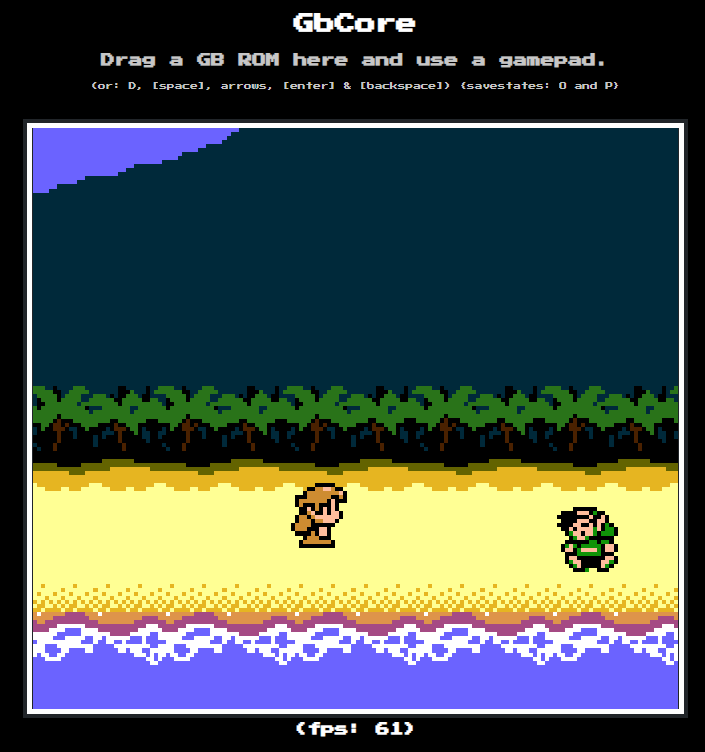

# gbcore

A basic GB/GBC emulator (executes whole instructions and scanlines, not cycle-accurate) made for educational purposes: just to learn about the system!

## Features

- 🧠 CPU, 🖥️ PPU, 🔊 APU
- 🌈 GBC features: WRAM/VRAM banks, palettes, tile attributes, priority rules, double-speed mode, VRAM DMA
- 🎮 Input support: keyboard and gamepad
- ⏲️ Timer support
- 🗜️ Mappers: NoMBC, MBC1, MBC2, MBC3, MBC5
- 📷 Save states
- 🐏 Save files

## Missing features

- Accurate timing
- Accurate initial state
- Serial
- IR port
- STOP instruction
- MBC3's RTC
- MBC5's rumble
- ...and more! ✨

## Usage

**`npm install --save gbcore`**

```js
// configure video and audio:
const onFrame = (frameBuffer) => {
  // write `frameBuffer` (a Uint32Array) to screen...
};
const onSample = (sample) => {
  // write `sample` (a number) to audio buffer...
};

// create an instance:
const gb = new Emulator(onFrame, onSample);

// load a game:
gb.load(rom); // rom = Uint8Array

// run at 60 fps, or as fast as you can:
{
  gb.setButton(1, "BUTTON_A", true); // player = 1, button = A, pressed = true
  gb.setButton(1, "BUTTON_DOWN", false); // player = 1, button = DOWN, pressed = false
  // ...set the rest of the buttons
  gb.frame();
}

// save / restore states:
const saveState = gb.getSaveState();
gb.setSaveState(saveState);
```

👀 Have a look at the [demo implementation](https://github.com/afska/gbcore/tree/master/src/gui) for more details.

## Full API

| Method          | Parameters                                        | Description                                                                                                                                                                                            |
| --------------- | ------------------------------------------------- | ------------------------------------------------------------------------------------------------------------------------------------------------------------------------------------------------------ |
| **constructor** | `onFrame`, `onSample` | Creates an emulator's instance. All properties can be set at any time.                                                                                         |
| `load`          | `rom`, _`saveFileBytes`_, _`forcedHardware`_                          | Loads a ROM. If a `saveFileBytes` array is provided, it sets the SRAM content. If a `forcedHardware` is provided (0 for DMG, 1 for GBC, 2 for GBA), it will emulate that system regardless of the ROM header.                                                                                                                          |
| `frame`         |                                                   | Runs the emulation for a whole video frame.                                                                                                                                                            |
| `samples`       | `requestedSamples`                                | Runs the emulation until the audio system generates `requestedSamples`.                                                                                                                                |
| `scanline`      |                                                   | Runs the emulation until the next scanline.                                                                                                                                                            |
| `setButton`     | `player`, `button`, `isPressed`                   | Sets the `button` state of `player` to `isPressed`. The `button` can be one of: `["BUTTON_A", "BUTTON_B", "BUTTON_SELECT", "BUTTON_START", "BUTTON_UP", "BUTTON_DOWN", "BUTTON_LEFT", "BUTTON_RIGHT"]` |
| `getSaveFile`   |                                                   | Returns an array with the SRAM bytes, or null.                                                                                                                                                         |
| `getSaveState`  |                                                   | Returns an object with a snapshot of the current state.                                                                                                                                                |
| `setSaveState`  | `saveState`                                       | Restores a `saveState`.                                                                                                                                                                                |

## Screenshots



## Debugging

You can inspect the emulator state by using the global `window.gb` object.

Also, if you add `?debug` to the URL and use a gamepad, shoulder buttons will behave as follows:

```
2--4
1--3

1: Enter debug mode
2: Exit debug mode
3: Hold to run frame
4: Hold to run scanline
```

## Useful links

- [Pan Docs](https://gbdev.io/pandocs/Memory_Map.html)
- [Dan Docs](https://shonumi.github.io/dandocs.html)
